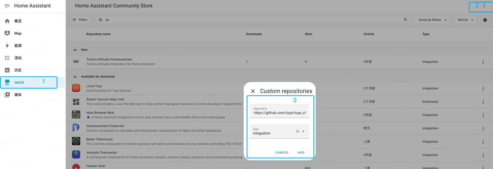
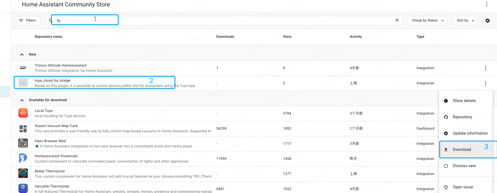
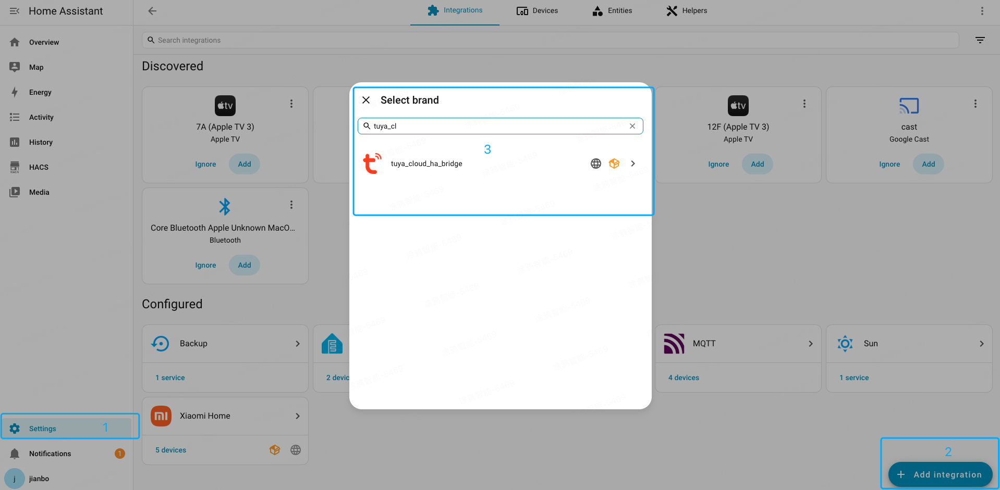
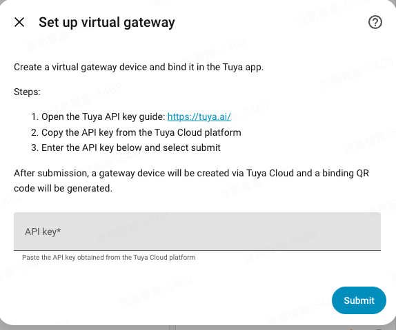
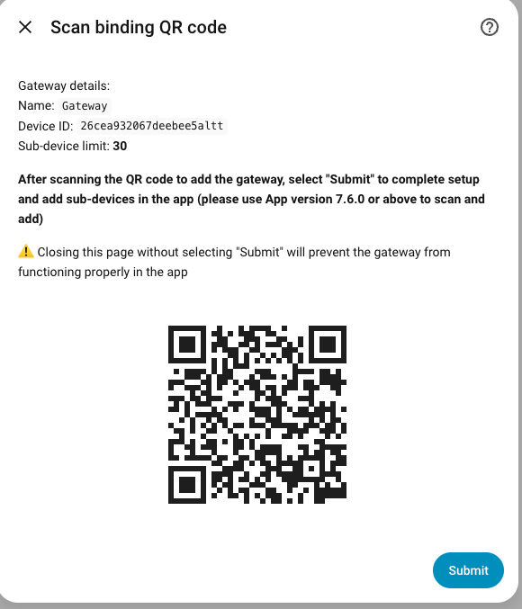
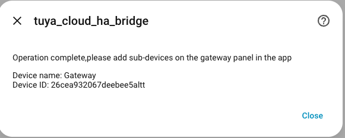

# tuya_cloud_ha_bridge

`tuya_cloud_ha_bridge` is a Home Assistant custom integration that syncs devices from Home Assistant to the Tuya app. The integration creates a virtual gateway in Tuya Cloud and uses Tuya Link MQTT for bidirectional cloud state synchronization, so you can control devices, build automations, and use voice integrations from the Tuya app.

中文说明: [`README_zh.md`](README_zh.md)

## Features

- Create a Tuya virtual gateway through the Home Assistant config flow
- Use Tuya Link MQTT for real-time bidirectional cloud synchronization
- Bind the virtual gateway in the Tuya app by scanning a QR code
- Add Home Assistant sub-devices from the gateway panel in the app
- Typical supported entity types include:
  `light`, `switch`, `fan`, `climate`, `cover`, `humidifier`, `vacuum`, `water_heater`

## Prerequisites

Before getting started, make sure:

- Home Assistant is already running properly
- You have prepared a Tuya Cloud `API Key`
- A Tuya app that supports QR-code binding is installed on your phone, and version `7.6.0` or later is recommended
- If you choose the `HACS` installation method, Home Assistant must be able to access GitHub
- If you choose the custom installation method, you must be able to access the Home Assistant `config` directory

## Installation

### Option 1: Install with HACS

#### Scenario A: HACS is not installed in Home Assistant yet

HACS is not included with Home Assistant by default. It is a community-maintained extension store. If HACS is not installed in your Home Assistant instance yet, follow the steps below to install and initialize it first.

##### 1. Check the prerequisites

- Home Assistant is installed and running normally
- You have a valid GitHub account for the authorization step
- You can access the Home Assistant file system, for example through `Advanced SSH & Web Terminal` or `File Editor`

##### 2. Install HACS with the script

1. Open the Home Assistant terminal
2. Run the following command to install HACS:

```bash
wget -O - https://get.hacs.xyz | bash -
```

3. Wait until the script finishes
4. Restart Home Assistant after the script completes

##### 3. Integrate HACS from the UI

After the restart, HACS will not appear in the left sidebar immediately. You still need to complete the integration flow from the Home Assistant UI:

1. Click `Settings` in the lower-left corner
2. Go to `Devices & Services`
3. Click `Add Integration` in the lower-right corner
4. Search for `HACS`
5. Select all declaration checkboxes
6. The page will show an 8-digit verification code
7. Click the GitHub authorization link shown on the page
8. Enter the verification code on GitHub and complete the authorization

##### 4. Confirm that HACS is enabled

After the authorization is complete, HACS will appear in the left sidebar of Home Assistant. Make sure HACS opens normally before continuing with the plugin installation steps in "Scenario B" below.

If you need a more detailed HACS installation guide with screenshots, search online for the matching Home Assistant / HACS version you are using.

#### Scenario B: HACS is already installed in Home Assistant

1. Open `HACS` in Home Assistant
2. Open the custom repository management page and add a custom repository
3. Use the following repository URL:
   `https://github.com/tuya/tuya_cloud_ha_bridge.git`
4. Select the type: `Integration`



5. After the repository is added successfully, search for `tuya_cloud_ha_bridge` in HACS



6. Restart Home Assistant

### Option 2: Custom installation

1. Clone or download this repository
2. Copy the `custom_components/tuya_cloud_ha_bridge` directory to `config/custom_components/` in Home Assistant
3. Restart Home Assistant

If you want to perform the copy directly on your local machine, you can use the helper script included in this repository:

```bash
./scripts/install_to_ha_custom_components.sh /path/to/homeassistant/config
```

For example:

```bash
./scripts/install_to_ha_custom_components.sh "/Volumes/homeassistant/config"
```

## Configuration

### Step 1: Add the integration

1. Open Home Assistant
2. Go to `Settings > Devices & Services`
3. Click `Add Integration`
4. Search for `tuya_cloud_ha_bridge`



5. Open the integration setup flow

### Step 2: Enter the API key

1. Follow the instructions in the wizard to open the Tuya API key page: <https://tuya.ai/>
2. Copy the `API Key` from Tuya Cloud
3. Return to Home Assistant and paste the API key into the input field



4. Click `Submit`

After submission, the integration will:

- Create a virtual gateway in Tuya Cloud
- Establish a temporary MQTT connection
- Generate a QR code for gateway binding

### Step 3: Scan the QR code in the Tuya app to bind the gateway

1. View the binding QR code on the Home Assistant configuration page
2. Open the Tuya app and scan the QR code



3. Complete the gateway setup flow in the app
4. After returning to the Home Assistant page, make sure to click `Submit`



> Note: If you close the page directly after scanning the QR code without clicking `Submit`, the virtual gateway may not work correctly in the app.

### Step 4: Add sub-devices in the app

After the binding is complete, open the virtual gateway panel in the Tuya app and add the Home Assistant sub-devices that you want to sync under this gateway.

## Troubleshooting

### 1. The integration cannot be found

- Make sure the plugin directory has been copied to `config/custom_components/tuya_cloud_ha_bridge`
- Make sure Home Assistant has been restarted after the copy
- Make sure the folder name matches the `domain` value in `manifest.json`

### 2. The API key fails validation

- Make sure you entered the `API Key` provided by Tuya Cloud
- Make sure the region of the API key is supported by this integration

### 3. The gateway is unavailable after scanning

- Make sure you returned to the Home Assistant page and clicked `Submit` after scanning
- Make sure the Home Assistant network can access the Tuya MQTT service

## Repository Layout

- `custom_components/tuya_cloud_ha_bridge`: Home Assistant custom integration directory
- `images`: screenshots used by the README installation and configuration guide
- `scripts/install_to_ha_custom_components.sh`: helper script for copying the plugin into a local Home Assistant `custom_components` directory

## License

[MIT License](LICENSE)
