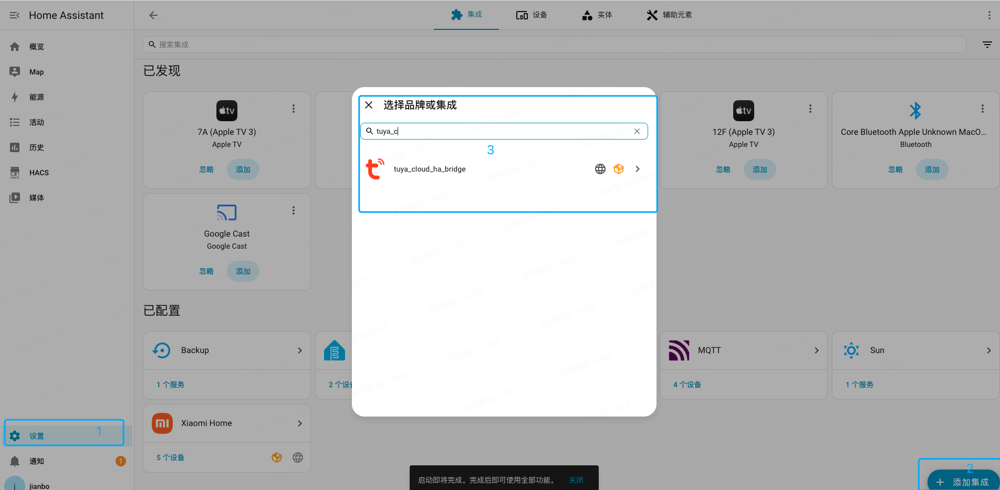
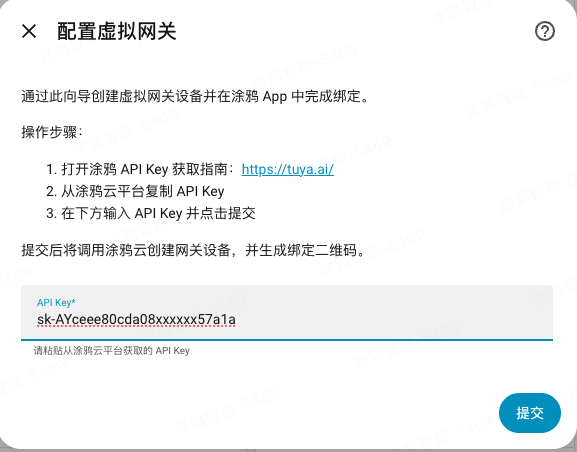
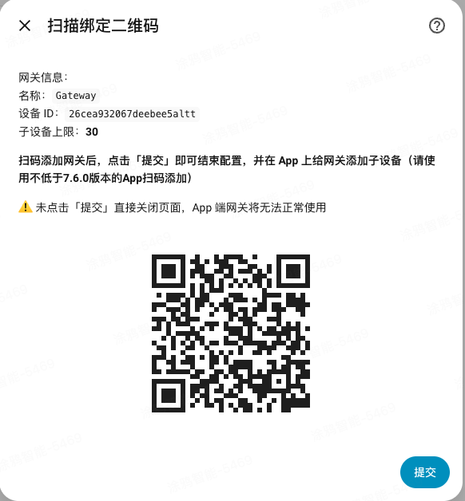
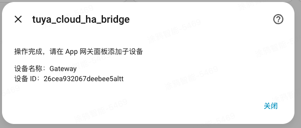

# tuya_cloud_ha_bridge

`tuya_cloud_ha_bridge` 是一个 Home Assistant 自定义集成，让你在涂鸦 App 中直接控制 Home Assistant 里的设备，并使用 App 的自动化和语音联动能力。

它的工作方式是：在涂鸦云侧创建一个「虚拟网关」，把 Home Assistant 的设备作为子设备挂在网关下，再通过 Tuya Link MQTT 实现两端实时双向状态同步。

English documentation: [`README.md`](README.md)

## 功能特性

- 在 Home Assistant 中通过配置流创建涂鸦虚拟网关
- 基于 Tuya Link MQTT 实现云端实时双向状态同步
- 支持在涂鸦 App 中扫描二维码绑定虚拟网关
- 支持在 App 的网关面板中继续添加 Home Assistant 子设备
- 支持的典型实体类型包括：
  `light`、`switch`、`fan`、`climate`、`cover`、`humidifier`、`vacuum`、`water_heater`

## 环境准备

开始前请确认：

- Home Assistant 已正常运行
- 已准备好涂鸦云平台的 `API Key`
- 手机已安装支持扫码绑定的涂鸦 App，建议 App 版本不低于 `7.6.0`
- 如果选择 `HACS 安装`，请确保 Home Assistant 可以联网并访问 GitHub
- 如果选择 `自定义安装`，请确保你可以访问 Home Assistant 的 `config` 目录

## 安装方式

### 方式一：通过 HACS 安装

> 前置条件：需要先装好 HACS。HACS 是社区维护的第三方扩展商店，并非 Home Assistant 自带，安装方式请参考 [HACS 官方文档](https://hacs.xyz/)。装好后再按下面步骤添加本集成。

1. 打开 Home Assistant 的 `HACS`
2. 进入自定义仓库管理页面，添加自定义仓库
3. 仓库地址填写：
   `https://github.com/tuya/tuya_cloud_ha_bridge.git`
4. 类型选择：`Integration`


5. 添加成功后，在 HACS 中搜索 `tuya_cloud_ha_bridge`


6. 重启 Home Assistant

### 方式二：自定义安装

1. 克隆或下载本仓库
2. 将目录 `custom_components/tuya_cloud_ha_bridge` 复制到 Home Assistant 的 `config/custom_components/` 下
3. 重启 Home Assistant

如果你希望在本机直接执行复制操作，可以使用仓库中的脚本：

```bash
./scripts/install_to_ha_custom_components.sh /path/to/homeassistant/config
```

例如：

```bash
./scripts/install_to_ha_custom_components.sh "/Volumes/homeassistant/config"
```

## 配置步骤

整个配置就是一条链，先看懂逻辑再操作就不会乱：

> 在 HA 中装好集成 → 集成在涂鸦云侧建一个「虚拟网关」并生成二维码 → 用涂鸦 App 扫码，把网关绑到你的账号 → 在 App 的网关面板里挂上要同步的 Home Assistant 设备。

记住一个关系就够了：**网关是壳，要同步的设备是挂在壳下面的子设备**。

### 第 1 步：添加集成

1. 进入 Home Assistant
2. 打开 `设置 > 设备与服务`
3. 点击 `添加集成`
4. 搜索 `tuya_cloud_ha_bridge`

5. 打开集成配置向导

### 第 2 步：输入 API Key

1. 按向导提示打开涂鸦 API Key 获取页面：<https://tuya.ai/>
2. 从涂鸦云平台复制 `API Key`
3. 回到 Home Assistant，在输入框中粘贴 API Key



4. 点击 `提交`

提交后，集成会：

- 在涂鸦云侧创建虚拟网关
- 建立临时 MQTT 连接
- 生成用于绑定网关的二维码

### 第 3 步：使用涂鸦 App 扫码绑定网关

1. 在 Home Assistant 配置页查看绑定二维码
2. 打开涂鸦 App 并扫描二维码



3. 完成 App 侧的网关添加流程
4. 完成后**必须回到 Home Assistant 页面点击 `提交`**，集成才会正式保存这个网关。如果直接关掉页面没有点提交，网关将无法在 App 中正常使用。



### 第 4 步：在 App 中添加子设备

绑定完成后，请进入涂鸦 App 的虚拟网关面板，在网关下继续添加要同步的 Home Assistant 子设备。

## 常见问题

### 1. 搜索不到集成

- 确认插件目录已复制到 `config/custom_components/tuya_cloud_ha_bridge`
- 确认复制完成后已重启 Home Assistant
- 确认目录名和 `manifest.json` 中的 `domain` 一致

### 2. API Key 无法通过校验

- 请确认填写的是涂鸦云平台提供的 `API Key`
- 请确认该 API Key 所属区域受当前集成支持

### 3. 扫码后网关不可用

- 请确认扫码完成后回到 Home Assistant 页面点击了 `提交`
- 请确认 Home Assistant 所在网络能够访问涂鸦 MQTT 服务

## 目录说明

- `custom_components/tuya_cloud_ha_bridge`：Home Assistant 自定义集成目录
- `images`：README 文档中使用的安装和配置流程截图
- `scripts/install_to_ha_custom_components.sh`：将插件复制到本地 Home Assistant `custom_components` 目录的辅助脚本

## License

[MIT License](LICENSE)
